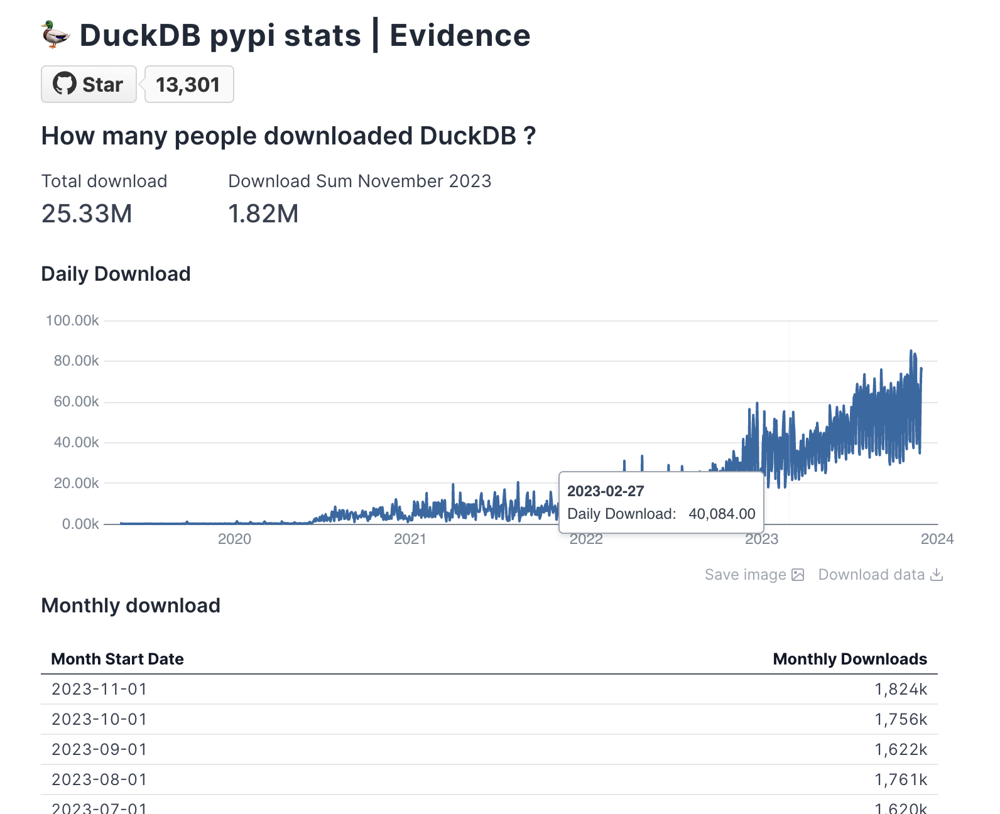
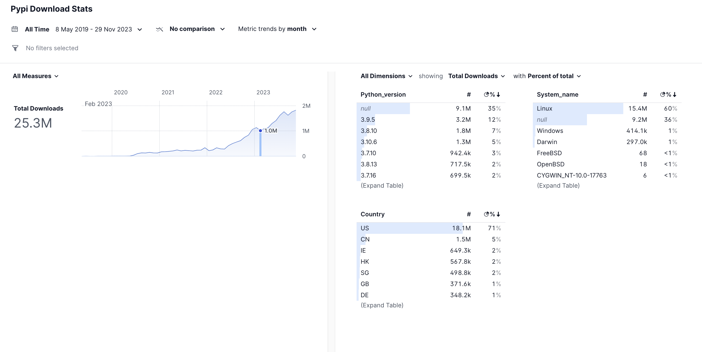
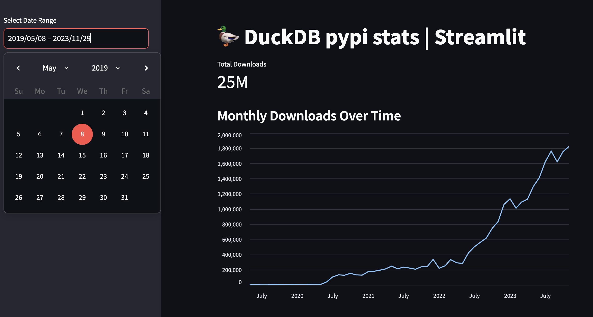

# BI as a code demo using DuckDB
This repository contains 3 examples of how to use DuckDB & BI-as-code tools to create dashboards and reports.
Each tool has its own folder with self-contained data and code. Each dashboard is using a local DuckDB db (stored in this repository) that contains data about Pypi statistics on `DuckDB` project.

## [Evidence](https://evidence.dev)

## [Rill](https://www.rilldata.com/)

## [Streamlit](https://streamlit.io/)

## Requirements
* NodeJS 18 (only for Evidence)
* Python 3.9 & Poetry (only for Streamlit)
* GNU Make
OR Docker for Desktop & [devcontainer extension](https://code.visualstudio.com/docs/devcontainers/containers) w/ VSCode. A devcontainer definition is located in `.devcontainer` folder.

## Running the demos
A `Makefile` contains target to install dependencies and run each dashboard locally.
- Evidence : `make evidence-install` && `make evidence`
- Rill : `make rill-install` && `make rill`
- Streamlit : `make streamlit-install` && `make streamlit`
